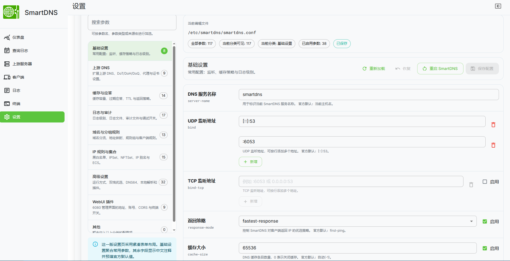

# SmartDNS WebUI 设置说明。



本仓库基于上游项目 [pymumu/smartdns](https://github.com/pymumu/smartdns) 进行调整。

## 说明

- 上游项目： [pymumu/smartdns](https://github.com/pymumu/smartdns)
- 本仓库不改变 SmartDNS 核心解析能力
- 本仓库主要是在 WebUI 中增加和完善设置功能，便于通过界面配置 `smartdns.conf`

## 当前改动方向

- 为 6080 WebUI 增加更完整的设置页
- 尽量将 `smartdns.conf` 参数表单化

## 参考

- 上游官方文档：<https://pymumu.github.io/smartdns/>

## 安装
deb包上传至/tmp，执行以下命令（smartdns.9.2026.05.22.amd64-debian-all.deb自行替换）。  
```cd /tmp
apt install ./smartdns.9.2026.05.22.amd64-debian-all.deb
systemctl enable smartdns.service --now```

## 卸载
'apt purge smartdns -y'